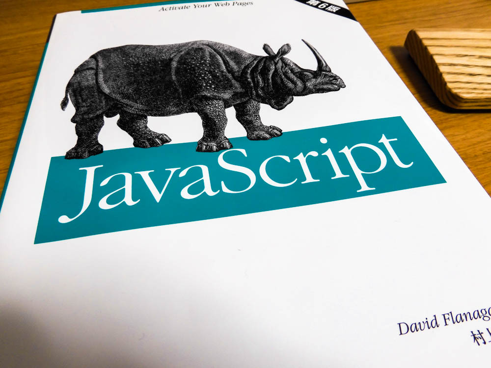

# learning-javascript
JavaScriptで勉強したことのまとめです。  

<!-- START doctoc generated TOC please keep comment here to allow auto update -->
<!-- DON'T EDIT THIS SECTION, INSTEAD RE-RUN doctoc TO UPDATE -->
目次

- [このプロジェクトの構成](#%E3%81%93%E3%81%AE%E3%83%97%E3%83%AD%E3%82%B8%E3%82%A7%E3%82%AF%E3%83%88%E3%81%AE%E6%A7%8B%E6%88%90)

<!-- END doctoc generated TOC please keep comment here to allow auto update -->
 

## このプロジェクトの構成

| ディレクトリ                                         | 内容                     |
| ---------------------------------------------- | ---------------------- |
| [変数スコープ](./1-scope)     |                     |
| [変数](./2-variable)     |                     |
| [関数](./3-function)     |                     |
| [クラスについて](./4-class)     |                     |
| [Objectについて](./1-object)     | Objectの基礎                    |
|                                                |                   |
|                                                |                  |

 
